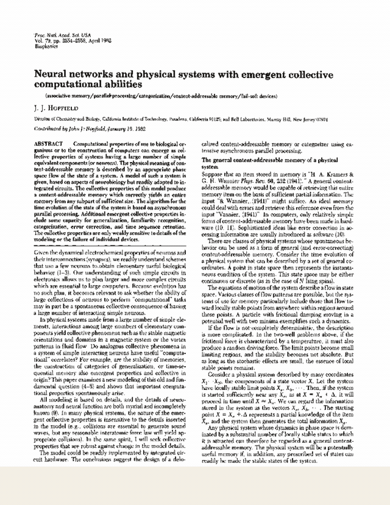

# The paper that remembers itself

**Hopfield 1982, running its own equations on its own print.**

**Live: [unt1l1f1nd-paper-remembers.static.hf.space](https://unt1l1f1nd-paper-remembers.static.hf.space)** — scribble on the page and let go.

The scanned pages of J. J. Hopfield's *Neural networks and physical systems
with emergent collective computational abilities* (PNAS 79:2554–2558, 1982)
are the site. Four printed equations on page 2556 — [6], [7], [8], [9] — are
stored as memories in a Hopfield network whose neurons are the pixels of the
print (binarized: ink = 1, paper = 0). You smudge an equation with your
cursor; the network runs and the print heals. The energy that pulls it back
is equation [7], printed on the page it is repairing.

## What is faithful to the paper

- **Storage** is exactly Eq [2]: `T_ij = Σ_s (2V_i^s−1)(2V_j^s−1)`, `T_ii = 0`.
- **Dynamics** is exactly Eq [1]: asynchronous, random order, no synchrony
  anywhere. The healing demo uses the paper's own p. 2557 threshold
  refinement — "a judicious choice of individual neuron thresholds … is
  equivalent to using variables μᵢ = ±1 … and a threshold level of 0" —
  because print is sparse ink on white (biased patterns), and in the plain
  0/1 variables symmetric noise on a sparse pattern always tips into the
  complement basin. The Fig. 2 bench uses the plain `V ∈ {0,1}`, `U_i = 0`
  model, because that is what the paper's own simulations ran.
- **Energy** is exactly Eq [7], recomputed live; rule [1] can only decrease it
  (Eq [8]) — the instrument's downhill trace is a theorem, not a rendering.
- **The failure modes are honest physics**: past 50% corruption the print
  heals into its own photographic negative — the complement is an equally
  deep minimum. At exactly 50% it's a coin toss. Erase everything and the
  equation resurrects: blank paper still agrees with the print on the whole
  background, and that agreement is inside the basin.
- **One net per equation, for the paper's own reason**: the four strips share
  their white background, and p. 2557 warns "memories too close to each other
  are confused and tend to merge." We measured it — stored together, they do
  (pairwise distance ≈ 0.2 N; recall fails). So each equation gets its own
  `T_ij`, and the merge warning became a design constraint instead of a bug.
- **Fig. 2 is re-run live**: N = 100, n random memories, each started at its
  nominal state and relaxed; histogram of errors, same binning spirit. The
  paper's 0.15 N capacity limit reproduces in your browser in milliseconds
  (verified: n = 5 → 100% exact recall, n = 15 → ~15%, matching the paper's
  "almost always stable" vs "about half … evolved to states quite different").

## What is adapted (honestly)

- The paper's own simulations used N = 30 and N = 100. The healing demo uses
  N = 38,880 (540×72 pixels per equation strip) — same equations, bigger net.
- `T` is never materialized (N² would be 1.5 G entries). With the Hebbian `T`
  of Eq [2], the field on neuron *i* is computed from overlaps
  `m_s = ξ^s·state` maintained incrementally; energy comes from the same
  factorization. Algebraically identical to the dense `T`, update by update.
- "Corruption" = independent bit flips (Hamming noise); damage is by cursor
  only — drag across the print to flip bits under the brush. No corrupt/erase
  buttons; the photographic-negative basin is reachable by scribbling out more
  than half of an equation.
- The update schedule is a fresh random permutation per pass; the paper's
  process is random attempts at mean rate W (with replacement). Same fixed
  points, same monotone energy — the permutation just makes "stable" cheap to
  detect (one full pass, zero flips).
- On load, a guided intro card runs a self-contained mini-demo — Eq [7]
  smudged and healed inside the card, narrated in three beats — so the whole
  idea lands in about five seconds before anyone scrolls. Same physics as the
  interactive path, on its own copy of the pattern; skippable; suppressed
  under `?debug`.
- The live bench re-runs **Fig. 2** (the recall-error histogram, p. 2557), not
  Fig. 1 (the neuron input-output sigmoid on p. 2555).

## Prior art

Interactive Hopfield demos are a genre — letter/image denoising, network
visualizers, [hopfield-layers](https://ml-jku.github.io/hopfield-layers/) for
the attention connection. We found no prior instance of the self-referential
version: the paper's own scanned print as the stored memories, repaired by
the equation printed on it. If you know one, open an issue.

## The author

John J. Hopfield (b. 1933), condensed-matter physicist turned biophysicist
(Bell Labs, Princeton, Caltech). This paper — five pages, contributed to PNAS
by himself, as Academy members could — founded attractor neural networks, and
in 2024 won him the Nobel Prize in Physics, shared with Geoffrey Hinton,
"for foundational discoveries and inventions that enable machine learning
with artificial neural networks." Forty-two years between the print and the
prize.

## Files

- `index.html` — the pages, the instrument rail, the Fig. 2 bench
- `hopfield.js` — the 1982 network (Eqs [1], [2], [7], factorized field/energy)
- `app.js` — binarize the print into patterns, smudge, heal animation,
  energy instrument, Fig. 2 replication
- `media/page-*.png` — the scan, 150 dpi renders (the source PDF itself is
  deliberately not in the repo — see Provenance & rights)
- `?debug` in the URL outlines the stored patch regions

## Dev

    python3 -m http.server 8080     # then http://localhost:8080

Regenerate page renders (needs your own copy of the scan, not shipped):
`pdftoppm -png -r 150 hopfield1982.pdf media/page`

## Provenance & rights

Paper © 1982 National Academy of Sciences; scan via JSTOR. Only the page
renders ship here, for personal, educational use, with the original notice
retained on the print; the PDF stays out of the repo.
2020 footnote in the margin: Ramsauer et al., *Hopfield Networks is All You
Need* (arXiv:2008.02217) — the modern continuous Hopfield update is exactly
transformer attention.
