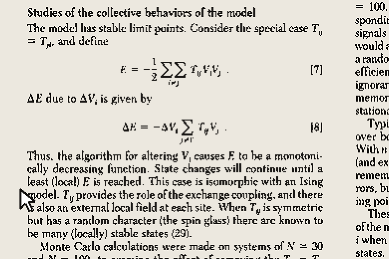

# The paper that remembers itself

**Hopfield 1982, running its own equations on its own print.**

**Live: [unt1l1f1nd-paper-remembers.static.hf.space](https://unt1l1f1nd-paper-remembers.static.hf.space)** — scribble on any page and let go.

*Not a rendering: the frames are the real network relaxing, all five pages
stored, and it lands back on p. 2556 with zero pixels wrong.*

The scanned pages of J. J. Hopfield's *Neural networks and physical systems
with emergent collective computational abilities* (PNAS 79:2554–2558, 1982)
are the site. All five pages are stored as memories in **one** Hopfield
network whose neurons are the pixels of the print (binarized: ink = 1,
paper = 0; N = 760 × 1032 = 784,320 neurons, n = 5 memories). Scribble
anywhere on any page and let go: the network runs and the whole page heals —
recalling the *right* page out of five, with nobody telling it which one you
wrecked. The energy that pulls it back is equation [7], printed on the page
it is repairing.

The paper even names what you're watching. On p. 2557, in Hopfield's own
italics: *"The phase space flow is apparently dominated by attractors which
are the nominally assigned memories, each of which dominates a substantial
region around it."* That sentence is one of the stored memories — the line
that named the attractors sits inside one.

## What is faithful to the paper

- **Dynamics** is exactly Eq [1]: asynchronous, one neuron at a time, no
  synchrony anywhere. The healing demo uses the paper's own p. 2557 threshold
  refinement — "a judicious choice of individual neuron thresholds … is
  equivalent to using variables μᵢ = ±1 … and a threshold level of 0" —
  because print is sparse ink on white (biased patterns), and in the plain
  0/1 variables symmetric noise on a sparse pattern tips into the complement
  basin. The Fig. 2 bench uses the plain `V ∈ {0,1}`, `U_i = 0` model,
  because that is what the paper's own simulations ran.
- **Energy** is exactly Eq [7], recomputed live; rule [1] can only decrease it
  (Eq [8]) — the instrument's downhill trace is a theorem, not a rendering.
- **The failure modes are honest physics.** Wipe out more than half a page
  and it heals into its own photographic negative — the complement is an
  equally deep minimum. Damage it past its basin and it can land on a
  *different* page — a neighbouring attractor. The readout names whichever
  valley you actually fell into.
- **The merge warning is demonstrated, not dodged.** P. 2557 warns "memories
  too close to each other are confused and tend to merge," and five mostly
  white pages are as close as memories get. Under Hopfield's own 1982 Hebbian
  storage (Eq [2]) they do merge — a toggle on the page lets you switch to
  that rule and watch all five blur into one ghost.
- **Fig. 2 is re-run live**: N = 100, n random memories, the 1982 Hebbian
  rule, each memory started at its nominal state and relaxed; histogram of
  errors, same binning spirit. The paper's 0.15 N capacity limit reproduces
  in your browser in milliseconds (n = 5 → near-perfect recall, n = 15 →
  recall falls apart, matching the paper's "almost always stable" vs "about
  half … evolved to states quite different").

## What is adapted (honestly)

- **Storage for the five-page demo is the projection (pseudo-inverse) rule**
  (Personnaz–Guyon–Dreyfus 1985), not the 1982 Hebbian of Eq [2] — because
  the Hebbian rule provably cannot hold five heavily correlated pages apart
  (see the merge toggle). Same network, same async dynamics, same energy
  form; only how the memories are written into the weights differs. The page
  says this out loud in "The honest details."
- The paper's own simulations used N = 30 and N = 100. The demo uses
  N = 784,320 — same equations, bigger net.
- `T` is never materialized (N² would be ~600 G entries). The field on
  neuron *i* is computed from the overlaps `m_s = ξ^s·state`, maintained
  incrementally — for the projection rule through the inverse of the tiny
  5 × 5 Gram matrix. Algebraically identical to the dense `T`, update by
  update.
- "Damage" is by cursor only — drag across the print to flip bits under the
  brush (each pixel flips with probability ½, i.e. Hamming noise). No
  corrupt/erase buttons; the photographic-negative basin is reachable by
  scribbling out more than half of a page.
- The update schedule is a fresh random permutation per pass; the paper's
  process is random attempts at mean rate W (with replacement). Same fixed
  points, same monotone energy — the permutation just makes "stable" cheap to
  detect (one full pass, zero flips).
- On load, a short narrated intro scribbles the first page and heals it back,
  so the whole idea lands in seconds before anyone scrolls. Skippable;
  suppressed under `?debug`.
- Each page carries a plain-English reading note beside it, so scrolling the
  paper doubles as a guided read of it.

## Prior art

Interactive Hopfield demos are a genre — letter/image denoising, network
visualizers, [hopfield-layers](https://ml-jku.github.io/hopfield-layers/) for
the attention connection. We found no prior instance of the self-referential
version: the paper's own scanned print as the stored memories, repaired by
the equation printed on it. If you know one, open an issue.

## The author

John J. Hopfield (b. 1933), condensed-matter physicist turned biophysicist
(Bell Labs, Princeton, Caltech). This paper — five pages, contributed to PNAS
by himself, as Academy members could — founded attractor neural networks, and
in 2024 won him the Nobel Prize in Physics, shared with Geoffrey Hinton,
"for foundational discoveries and inventions that enable machine learning
with artificial neural networks." Forty-two years between the print and the
prize.

## Files

- `index.html` — the five pages, the reading notes, the instrument rail, the
  Fig. 2 bench
- `hopfield.js` — the 1982 network (Eqs [1], [2], [7]; factorized
  field/energy; Hebbian and projection storage)
- `app.js` — binarize the print into patterns, scribble, heal animation,
  verdicts, energy instrument, intro narration, Fig. 2 replication
- `media/page-*.png` — the scan, 150 dpi renders (the source PDF itself is
  deliberately not in the repo — see Provenance & rights)
- `?debug` in the URL skips the intro

## Dev

    python3 -m http.server 8080     # then http://localhost:8080

Regenerate page renders (needs your own copy of the scan, not shipped):
`pdftoppm -png -r 150 hopfield1982.pdf media/page`

## Provenance & rights

The paper is © 1982 National Academy of Sciences. **The original is free to
read from the publisher — [pnas.org](https://www.pnas.org/doi/10.1073/pnas.79.8.2554)
— and that is where it should be read.**

Only reduced-resolution page renders ship here, for non-commercial,
educational use, with the original copyright notice left intact on the print.
They are the substrate this demonstration runs on, not a reading copy. The
source PDF is not distributed: it is neither in the working tree nor anywhere
in the git history.

This is an independent tribute. It is not published, endorsed by, or connected
with John Hopfield, PNAS, or the National Academy of Sciences. Any rights
holder who would prefer the page images taken down can open an issue here and
they will be removed.

2020 footnote in the margin: Ramsauer et al., *Hopfield Networks is All You
Need* (arXiv:2008.02217) — the modern continuous Hopfield update is exactly
transformer attention.